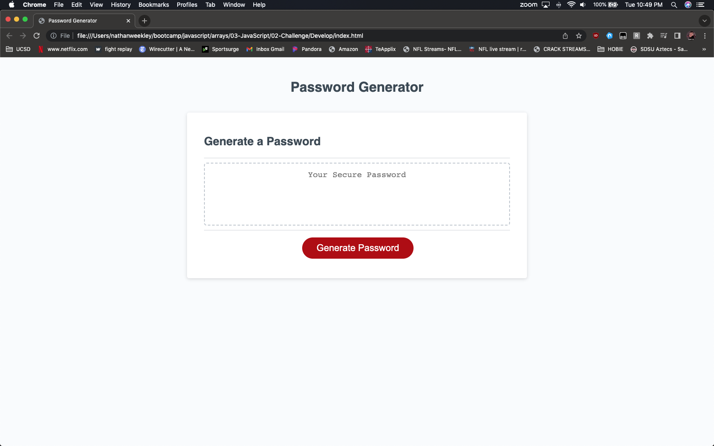
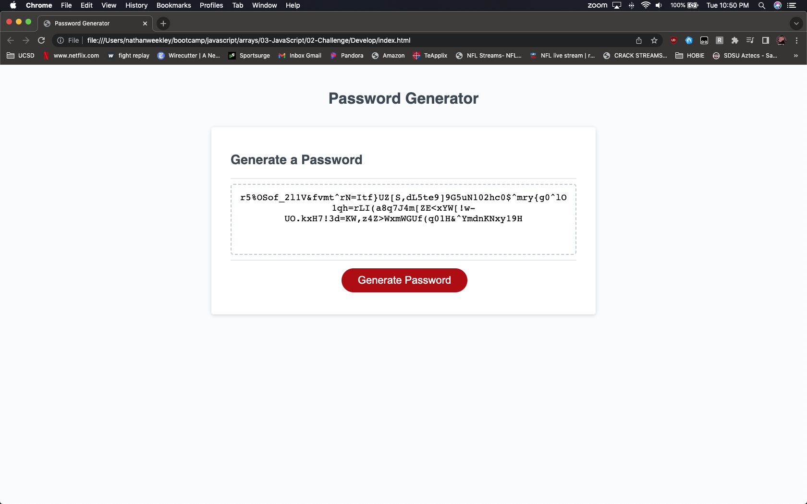

# Random Password Generator v1.0
> Add a function to pre-existing code to generate a random password.
> Must also prompt user for length of password between 8 and 128 characters.
> If a number doesn't meet password length requirements, start process over.
> Finally must also prompt for Upper/Lower/Number & Special characters.
> Write the generated password into the div class card-body on index.html.
> Live demo [_here_](https://nweekley84.github.io/password/).

## Table of Contents
* [General Info](#general-information)
* [Technologies Used](#technologies-used)
* [Features](#features)
* [Screenshots](#screenshots)
* [Setup](#setup)
* [Usage](#usage)
* [Project Status](#project-status)
* [Room for Improvement](#room-for-improvement)
* [Acknowledgements](#acknowledgements)
* [Contact](#contact)
* [License](#license)

## General Information
- Random password generator wasn't functioning. Created a password generator function for generatePassword().
- Previous button did nothing. Added multiple parameter prompts as well and now prints the final return of the generated password to a div card on index.html. Fail safe restarts the process if a invalid number is selected for the password string length in the array.
- Purpose is to fix pre-existing code, otherwise debugging. To get a better hands on experience with using arrays, prompts and dealing with user input for the first time.
- Undertaken because it's good practice.

## Technologies Used
- VSCode 1.76.2
- Chrome 112.0.5615.121 
- macOS Mojave 10.14.6 

## Features
- Upon button click, start list of prompts.
- First prompt for length 8 < 128, if not, fail and start over.
- Series of 4 Yes/No (defaulted to Yes) prompts for parameters: upperCase/lowerCase/numbers/specialChars set by user.
- Apply selected length to array and run the funtion, return the password and write it to the card on index.html.

## Screenshots

## Setup
N/A

## Usage
To quickly create a random 8-128 customized password.

## Project Status
Project is: / _complete_ /

## Room for Improvement
Room for improvement:
- Gain a better understanding of math.floor and math.random.

To do:
- I can't be sure, but I believe this challenge is done unless we revisit it.

## Acknowledgements
- This project was inspired by Manuel Campbell, his blog covers various functions using: Node.js, HTML and CSS, a random PIN code generator library, string methods and event handlers in JavaScript. Lots of various ways to accomplish the same task.
- This project was based on [this tutorial](https://copyprogramming.com/howto/create-a-customizable-random-password-generator-with-prompts-using-javascript).
- Many thanks to MDN Web Docs as well, I couldn't have figured out the var pwLength 8 < 128 parameters without it.

## Contact
Created by [nweekley84@gmail.com](mailto:nweekley84@gmail.com) - feel free to contact me!

## License
MIT
